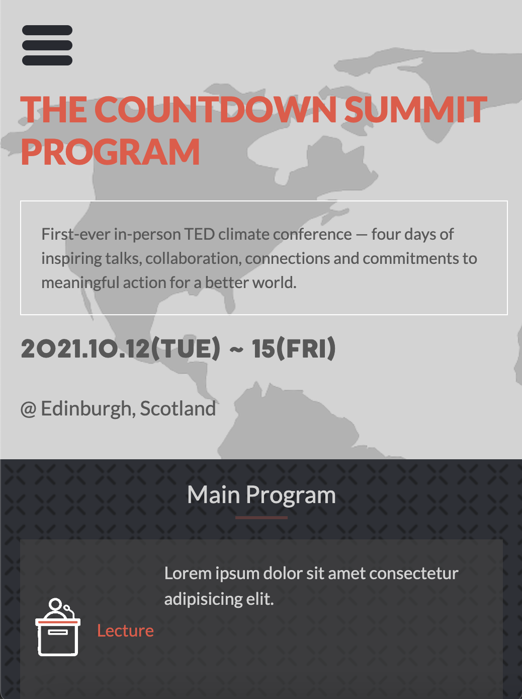

# Event Explorer

Event Explorer is a modern and responsive webpage for an upcoming conference. It is built with HTML, CSS, and JavaScript, and it showcases the event's program, featured speakers, and partners.




## Features

*   **Responsive Design:** The website is fully responsive and works on all devices, from mobile phones to desktop computers.
*   **Dynamic Speaker Section:** The featured speakers are loaded dynamically from a JSON file, making it easy to update the speaker list without changing the code.
*   **Mobile-First Approach:** The website is designed with a mobile-first approach, ensuring a great user experience on smaller screens.

## Built With

*   HTML
*   CSS
*   JavaScript

## Getting Started

To get a local copy up and running, follow these simple steps:

1.  Clone the repository:

```bash
git clone https://github.com/giantcobat/EVENT-EXPLORER.git
```

2.  Open the `index.html` file in your browser.

## Author

*   **Caleb Oheneba-Takyi**
    *   GitHub: [@giantcobat](https://github.com/giantcobat)
    *   LinkedIn: [Caleb Oheneba-Takyi](https://www.linkedin.com/in/caleb-oheneba-takyi)

## 🤝 Contributing

Contributions, issues, and feature requests are welcome!

Feel free to check the [issues page](https://github.com/giantcobat/EVENT-EXPLORER/issues).

## Show your support

Give a ⭐️ if you like this project!

## 📝 License

This project is [MIT](./MIT.md) licensed.